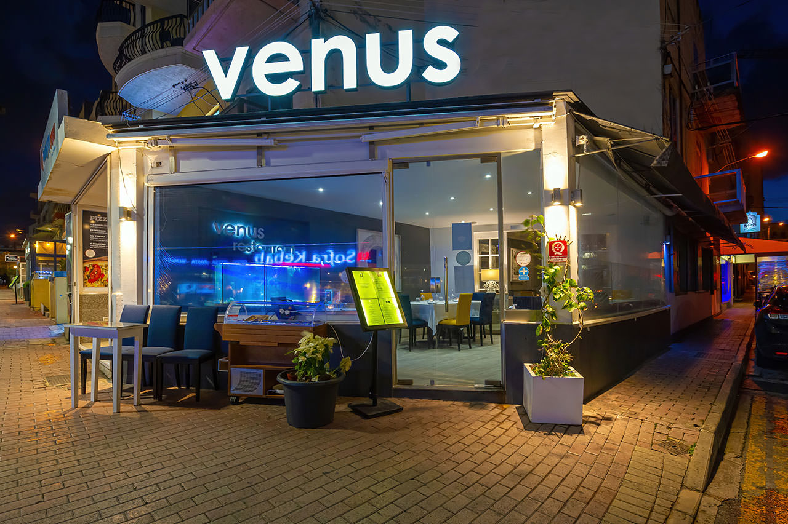

# Venus Cloud Restaurant
<kbd>

</kbd>

## About Venus

> Venus is the second planet from the Sun. It is named after the Roman goddess of love and beauty. As the brightest natural object in Earth's night sky after the Moon, Venus can cast shadows and can be, on rare occasions, visible to the naked eye in broad daylight.

## Navigation

- [Menu](menu.md)
- [About](aboot.md)